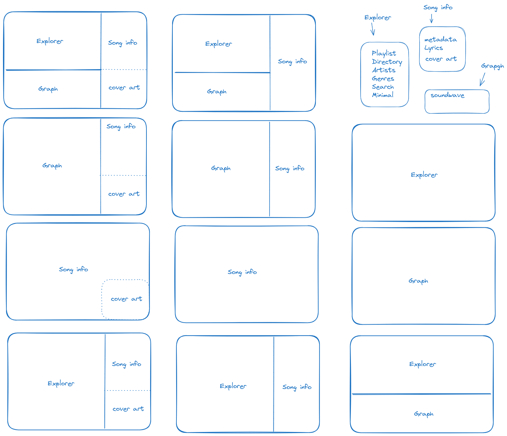

# Garyou Tensei Player

A feature-rich TUI client for MPD

## Screenshots

(Under development)

## Commands

(Under development)

## Project layout

    assets/           # App assets, like default cover art
    configs/          # App configuration file
    docs/
        assets/       # Documentation assets
        stylesheets/  # documentation stylesheets
        index.md      # The documentation homepage.
        ...           # Other markdown pages, images and other files.
    app/              # App source code
    LICENSE           # License
    mkdocs.yml        # The configuration file.
    poetry.lock       # Dependencies versions
    pyproject.toml    # Project package configuration
    README.md         # Project overview
